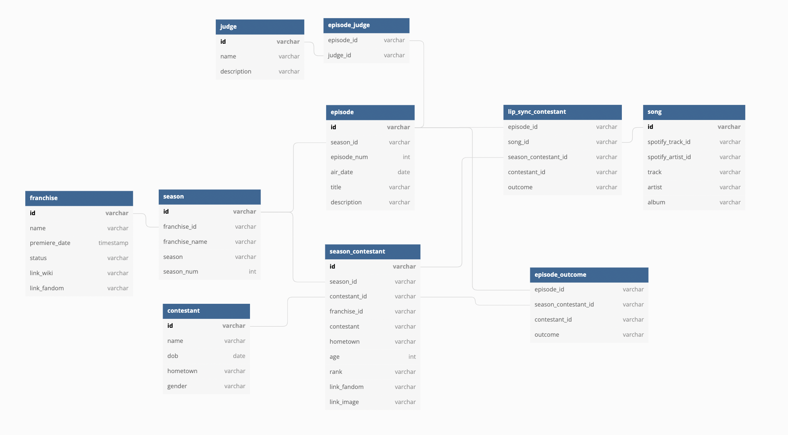
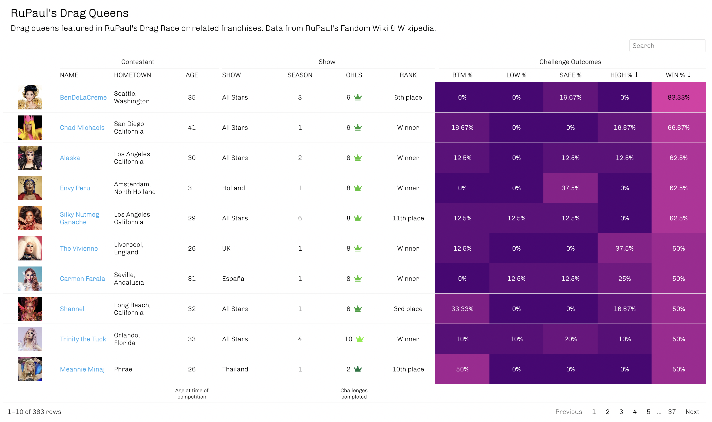
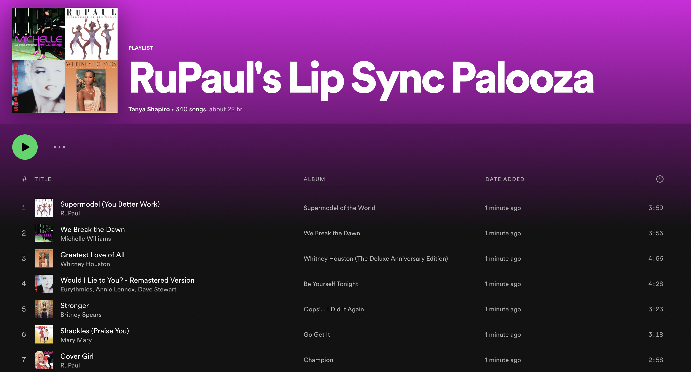

# :checkered_flag: Drag Race

## About
This project is dedicated to collecting, organizing, and analyzing information about [RuPaul's Drag Race](https://en.wikipedia.org/wiki/RuPaul%27s_Drag_Race) and related franchises (e.g. [RuPaul's All Stars](https://en.wikipedia.org/wiki/RuPaul%27s_Drag_Race_All_Stars), [Canada's Drag Race](https://en.wikipedia.org/wiki/Canada%27s_Drag_Race), [RuPaul's Drag Race UK](https://en.wikipedia.org/wiki/RuPaul%27s_Drag_Race_UK)). Information was collected for a total of 12 different franchises and for seasons completed as of July 1st, 2022. Data collection and data cleaning are performed using R.

Excerpts about Drag Race from [Wikipedia](https://en.wikipedia.org/wiki/Drag_Race_(franchise)):

>RuPaul's Drag Race, and Drag Race variants, is a television drag queen competition franchise created by American drag entertainer RuPaul, and the production company World of Wonder. It originated in the United States with RuPaul's Drag Race in 2009, where it was devised as a replacement for Rick & Steve: The Happiest Gay Couple in All the World (2007–2009). The show's aim is to find the next "Drag Superstar" who possesses the traits of "charisma", "uniqueness", "nerve" and "talent". RuPaul stated that the show looks for an entertainer who can stand out from the rest. RuPaul’s Drag Race is often credited for bringing drag into the "mainstream" media.

## Data Collection

The majority of this project's data was sourced from Wikipedia & [RuPaul's Fandom Wiki](https://rupaulsdragrace.fandom.com/wiki/RuPaul%27s_Drag_Race_Wiki). Web scraping was conducted in R using **rvest**. Additional data processing was needed to normalize and clean the data. Majority of these steps were performed using functions within **tidyverse** library (e.g. dplyr, stringr). To supplement data collected from these sites, I also used **[spotifyR](https://www.rcharlie.com/spotifyr/)**, a Spotify API wrapper for R, to collect additional song information for songs featured on different drag shows (lip sync songs). Important to note, in order to use spotifyR, a user must have create a [Spotify Developer](https://developer.spotify.com/) account. Details such as client ID and client ID secret are needed in order to authorize the app and generate an access token.

### Tables & Information Sources

| Dataset                 | Source                         | Description                                       |
|-------------------------|-------------------------------|---------------------------------------------------|
| [franchise][d1]         | Wikipedia                      | List of different drag race franchises            |
| [season][d2]            | Wikipedia                      | List of seasons per franchise               |
| [episode][d3]           | Wikipedia                      | List of episodes for each season and franchise            |
| [contestant][d4]        | Wikipedia & Fandom Wiki | List of all contestants       |
| [season_contestant][d5] | Wikipedia                      | List of contestants per season                    |
| [episode_outcome][d6]   | Wikipedia & Fandom Wiki                     | List of outcomes per contestant for each episode  |
| [lip_sync_contestant][d7]| Wikipedia                     | List of lip sync performances per episode & contestant                         |
| [song][d8]| Wikipedia & Spotify                     | List of all lip sync songs                         |

[d1]: data/franchise.csv
[d2]: data/season.csv
[d3]: data/episode.csv
[d4]: data/contestant.csv
[d5]: data/season_contestant.csv
[d6]: data/episode_outcome.csv
[d7]: data/lip_sync_contestant.csv
[d8]: data/song.csv

## Data Model

Below is a snapshot of ERD used to organize information collected from various online sites. The objective is to normalize the data to scale it to accomodate different Drag Race shows and competition formats. ERD diagram was rendedered using [dbdiagram](https://dbdiagram.io/).

**Note: Model is mostly conceptual. Data collection for certain table is still underway (e.g. judge, episode_judge).

## Visualizations & Applications

### RuPaul's Drag Queens

Drag...but make it like sports. I used **reactablefmtr** to generate an HTML table detailing information on season contestants and their respective outcomes. The interactive version is hosted [here](https://www.tanyashapiro.com/interactive-visuals/rpdr) on my site.
  

### RuPaul's Lip Syncs (Spotify Playlist)

In addition to producing visuals, I wanted to make a master playlist of all lip sync songs featured on various episodes of Drag Race. Using lip sync data collected from different season Wikipedias, I then used spotifyR to lookup their respective Spotify track IDs and add them to my own [playlist](https://open.spotify.com/playlist/1FN5Vh8bWSO3FoQFZr5lIA?si=J2sPjNl9RCO7eTlAEFDUWA&nd=1). The result - I now have 300+ songs and 20hrs worth of lip sync songs to shuffle through!

