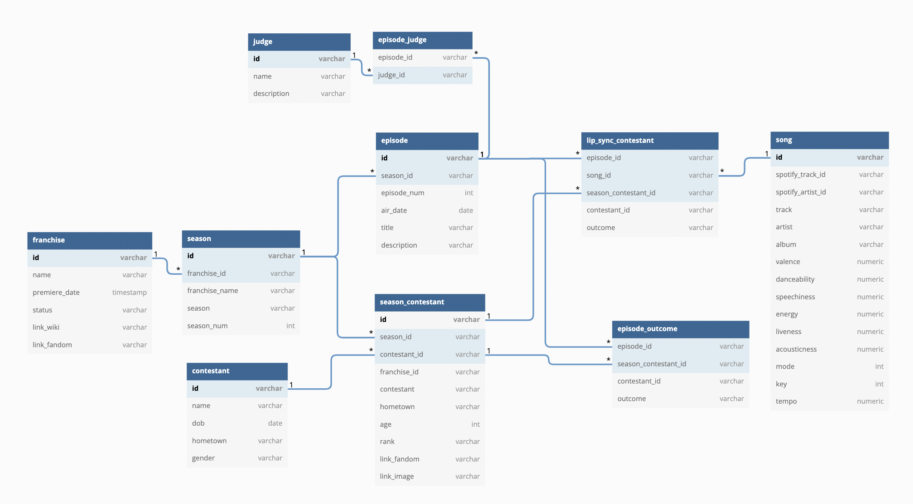
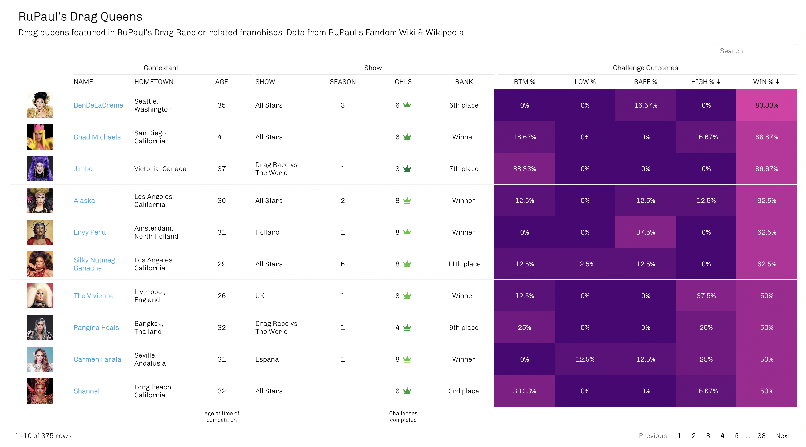
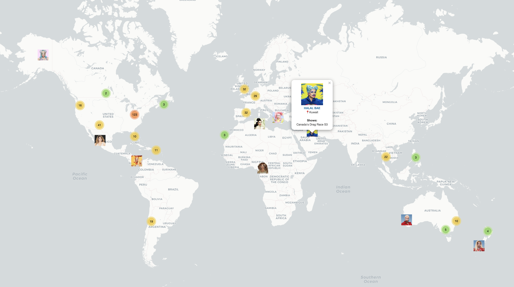
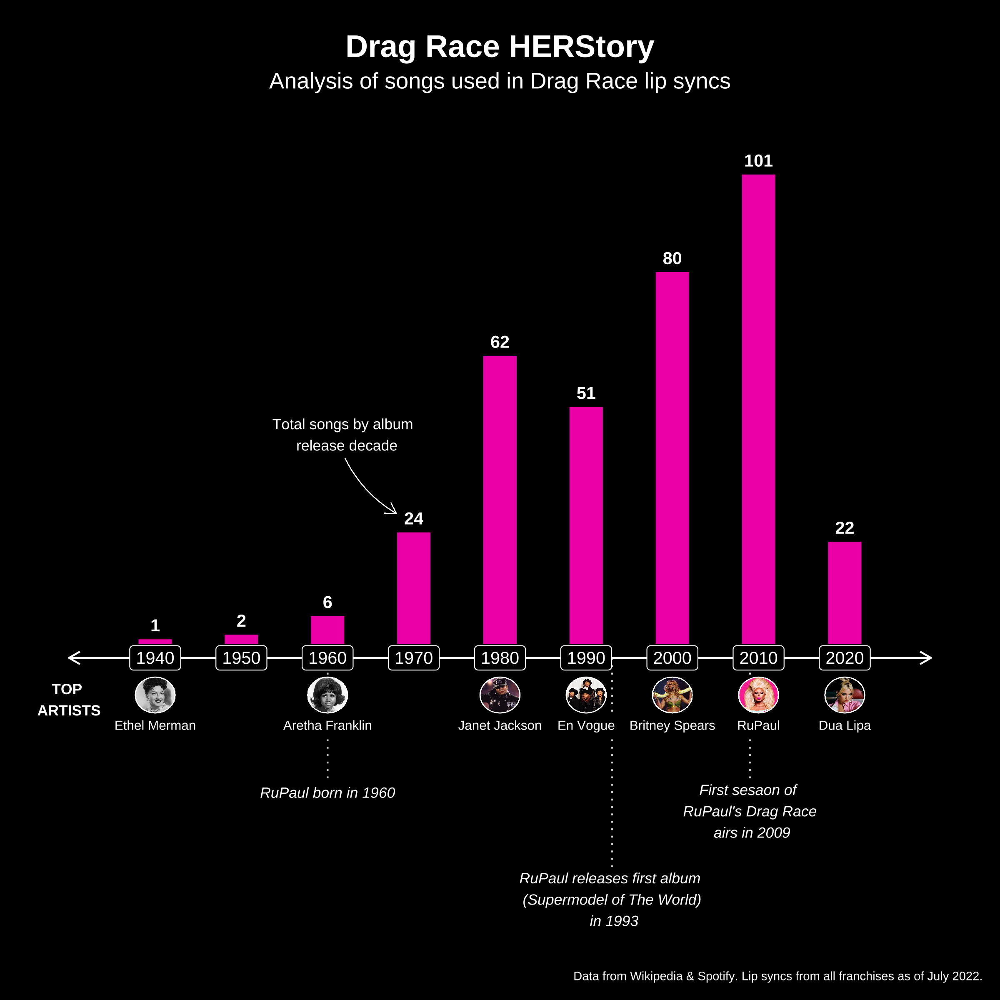

# :checkered_flag: Drag Race

## About
This project is dedicated to collecting, organizing, and analyzing information about [RuPaul's Drag Race](https://en.wikipedia.org/wiki/RuPaul%27s_Drag_Race) and related franchises (e.g. [RuPaul's All Stars](https://en.wikipedia.org/wiki/RuPaul%27s_Drag_Race_All_Stars), [Canada's Drag Race](https://en.wikipedia.org/wiki/Canada%27s_Drag_Race), [RuPaul's Drag Race UK](https://en.wikipedia.org/wiki/RuPaul%27s_Drag_Race_UK)). Data collection and data cleaning are performed using R.

Excerpts about Drag Race from [Wikipedia](https://en.wikipedia.org/wiki/Drag_Race_(franchise)):

>RuPaul's Drag Race, and Drag Race variants, is a television drag queen competition franchise created by American drag entertainer RuPaul, and the production company World of Wonder. It originated in the United States with RuPaul's Drag Race in 2009, where it was devised as a replacement for Rick & Steve: The Happiest Gay Couple in All the World (2007–2009). The show's aim is to find the next "Drag Superstar" who possesses the traits of "charisma", "uniqueness", "nerve" and "talent". RuPaul stated that the show looks for an entertainer who can stand out from the rest. RuPaul’s Drag Race is often credited for bringing drag into the "mainstream" media.

### Data Per Franchise

Below details the most recent updates per franchise. Datasets will be refreshed once new seasons are completed.

| Name                                        |   Region                  | Seasons | Note                                                 |
|:--------------------------------------------|:--------------------------|---------|:-----------------------------------------------------|
|   RuPaul's Drag Race                        |   United States           |   1-14  |                                                      |
|   RuPaul's Drag Race All Stars              |   United States           |   1-7   | S7 in progress, data incomplete |
|   The Switch Drag Race                      |   Chile                   | 2       | Excl. episodes, outcomes, lip syncs                  |
|   Drag Race Thailand                        |   Thailand                |   1-2   |                                                      |
|   RuPaul's Drag Race UK                     |   United Kingdom          |   1-3   |                                                      |
|   Canada's Drag Race                        |   Canada                  |   1-2   |                                                      |
|   Drag Race Holland                         |   Netherlands             |   1-2   |                                                      |
|   RuPaul's Drag Race Down Under             |   Australia, New Zealand  |   1     |                                                      |
|   Drag Race España                          |   Spain                   |   1-2   |                                                      |
|   Drag Race Italia                          |   Italy                   |   1     |                                                      |
|   RuPaul's Drag Race: UK vs the World       |   Global                  |   1     |                                                      |
|   Drag Race France                          |   France                  | 1       | S1 in progress, data incomplete |
|   Drag Race Philippines                     |   Philippines             |   -     | Not yet aired, no data     |
|   Canada's Drag Race: Canada vs. the World  |   Global                  |   -     | Not yet aired, no data   |
|   Drag Race Belgique                        |   Belgium                 | -       | Not yet aired, no data   |
|   Drag Race Sverige                         |   Sweden                  | -       | Not yet aired, no data    |

## Data Collection

### Web Scraping
The majority of this project's data was sourced from Wikipedia & [RuPaul's Fandom Wiki](https://rupaulsdragrace.fandom.com/wiki/RuPaul%27s_Drag_Race_Wiki). Web scraping was conducted in R using **[rvest](https://rvest.tidyverse.org/)**. Rvest is similar to BeautifulSoup (Python) in that it allows users to read and parse HTML code. Most of the scraping code employs different for loops to iterate through different web pages (e.g. each season has a separate Wikipedia page). After scraping the information, I used tidyverse libraries to normalize and clean the data (e.g. dplyr, stringr).

Scraping jobs are partitioned into separate R files:

| **File**     | **Dataset Produced**          |
|--------------|:------------------------------|
| [Part 1][p1] | franchise, season             |
| [Part 2][p2] | season_contestant, contestant |
| [Part 3][p3] | episode, episode_outcome      |
| [Part 4][p4] | lip_sync_contestant           |
| [Part 5][p5] | episode_judge                 |

[p1]: code/scraping-part-1.R
[p2]: code/scraping-part-2.R
[p3]: code/scraping-part-3.R
[p4]: code/scraping-part-4.R
[p5]: code/scraping-part-5.R

### Spotify
To supplement data collected from these sites, I also used **[spotifyR](https://www.rcharlie.com/spotifyr/)**, a Spotify API wrapper for R, to collect additional data points for songs featured on different drag shows (lip sync songs). These data points include audio features defined by Spotify such as **valence**, **danceability**, and **speechiness**. More details about Spotify audio features can be found in [Spotify's developer documentation](https://developer.spotify.com/documentation/web-api/reference/#/operations/get-audio-features). 

Important to note, in order to use spotifyR, a user must have create a [Spotify Developer](https://developer.spotify.com/) account. Details such as client ID and client ID secret are needed in order to authorize the app and generate an access token.

### Tables & Information Sources

| Dataset                 | Source                         | Description                                       |
|-------------------------|-------------------------------|---------------------------------------------------|
| [franchise][d1]         | Wikipedia                      | Drag Race franchises            |
| [season][d2]            | Wikipedia                      | Seasons per Drag Race franchise               |
| [episode][d3]           | Wikipedia                      | Episodes for each season and franchise            |
| [contestant][d4]        | Wikipedia & Fandom Wiki | Contestants (or queens)       |
| [season_contestant][d5] | Wikipedia                      | Contestants per season                    |
| [episode_outcome][d6]   | Wikipedia & Fandom Wiki                     | Outcomes per contestant for each episode  |
| [lip_sync_contestant][d7]| Wikipedia                     | Lip sync performances per episode & contestant                         |
| [song][d8]| Wikipedia & Spotify                     | Lip sync songs                         |
| [episode_judge][d9]| Wikipedia                     | Main and guest judges per episode                        |

[d1]: data/franchise.csv
[d2]: data/season.csv
[d3]: data/episode.csv
[d4]: data/contestant.csv
[d5]: data/season_contestant.csv
[d6]: data/episode_outcome.csv
[d7]: data/lip_sync_contestant.csv
[d8]: data/song.csv
[d9]: data/episode_judge.csv

## Data Model

Below is a snapshot of ERD used to organize information collected from various online sites. The objective is to normalize the data to scale it to accomodate different Drag Race shows and competition formats. ERD diagram was rendedered using [dbdiagram](https://dbdiagram.io/). Note: Model is  conceptual. Data collection for certain table may still be in progress (e.g. judge).

## Visualizations & Applications

### Drag NetWerk

I wanted to explore the relationships among contestants across different international franchises and seasons. The analysis includes contestants from region specific franchises - UK, Canada, Holland, España, Italia, and France - and includes cross-overs from RuPaul’s global “Drag vs. The World” spin-offs, e.g. Canada’s Drag Race vs. The World. The network graph was produced using **ggplot** and **GGally**. 

### RuPaul's Drag Queens

Drag...but make it like sports. I used **[reactablefmtr](https://kcuilla.github.io/reactablefmtr/)** to generate an HTML table detailing information on season contestants and their respective outcomes. The interactive version is hosted [here](https://www.tanyashapiro.com/interactive-visuals/rpdr) on my site.
  

### Where in The World Are You Queen?
Where are the queens originally from? I used **tidygeocoder** to produce the geo coordinates for each hometown, and used **leafletR** (Leaflet wrapper) to generate the map. It's pretty cool to see how Ru's family footprint has expanded around the world - you can find a queen in almost every continent!

:round_pushpin: [Find a Queen](https://www.tanyashapiro.com/interactive-visuals/map-drag-queens)
  

### Drag Race HERStory - Lip Syncs
Analysis of all lip sync songs featured on different seasons of Drag Race across all franchises. 
  

### RuPaul's Lip Sync Palooza (Spotify Playlist)

In addition to producing visuals, I wanted to make a master playlist of all lip sync songs featured on various episodes of Drag Race. Using lip sync data collected from different season Wikipedias, I then used spotifyR to lookup their respective Spotify track IDs and add them to my own playlist. The result - I now have 300+ songs and 20+hrs worth of listening time to shuffle through! 

:headphones: [RuPaul Lip Syncs Playlist](https://open.spotify.com/playlist/49xR85Shg0IuVS9xkcfNm6)

